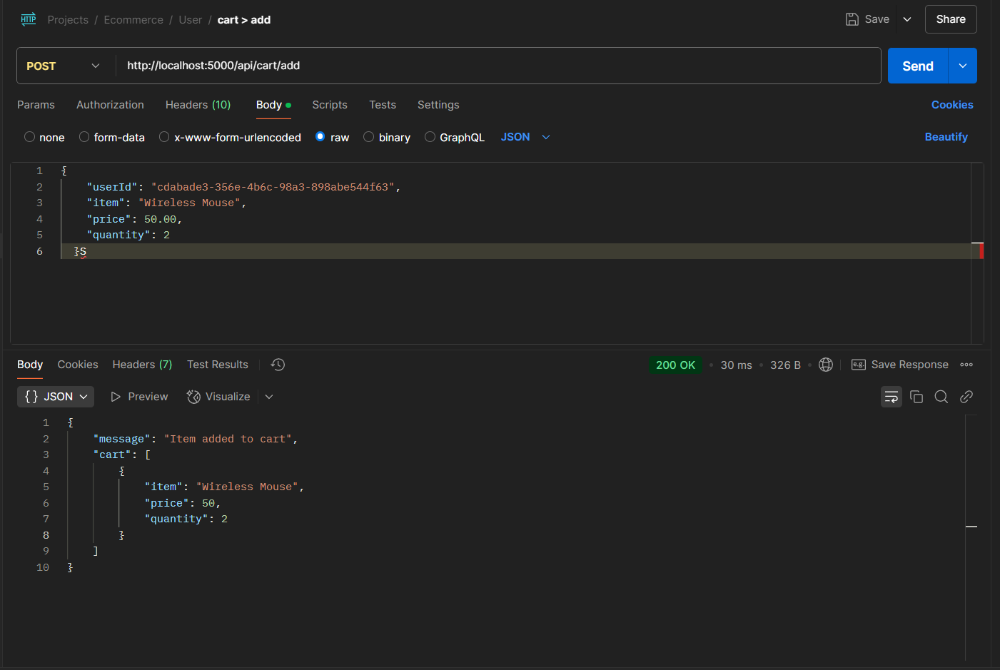
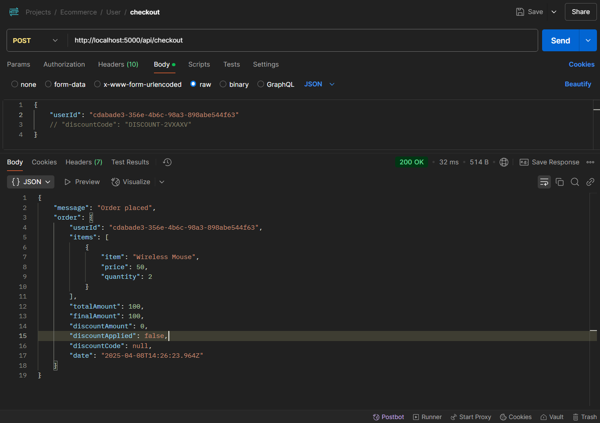
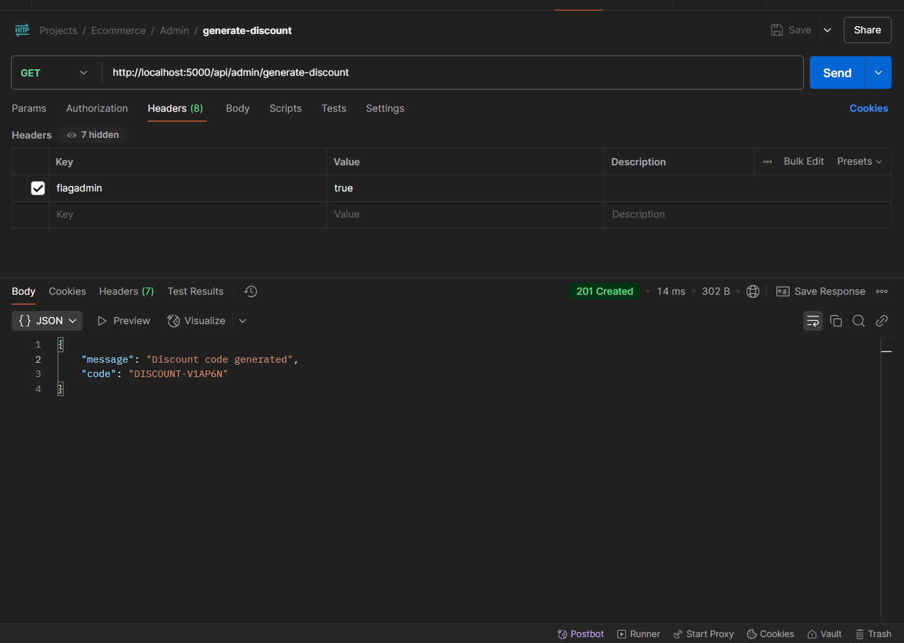
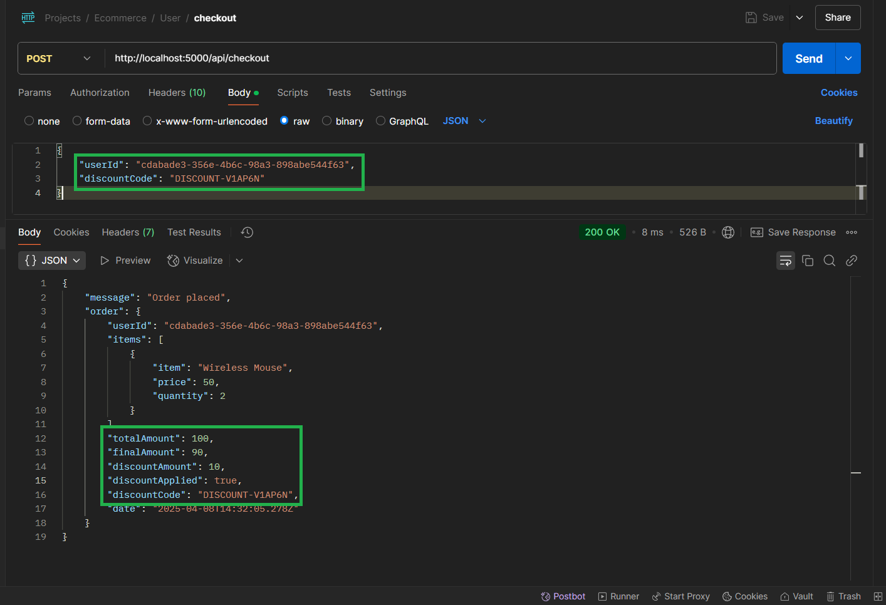
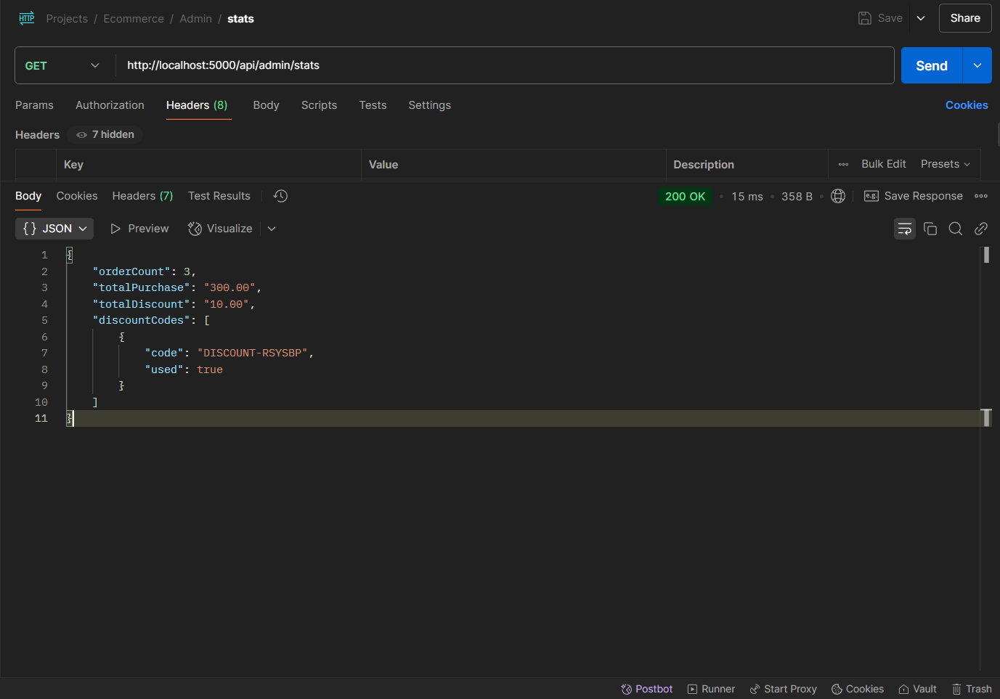
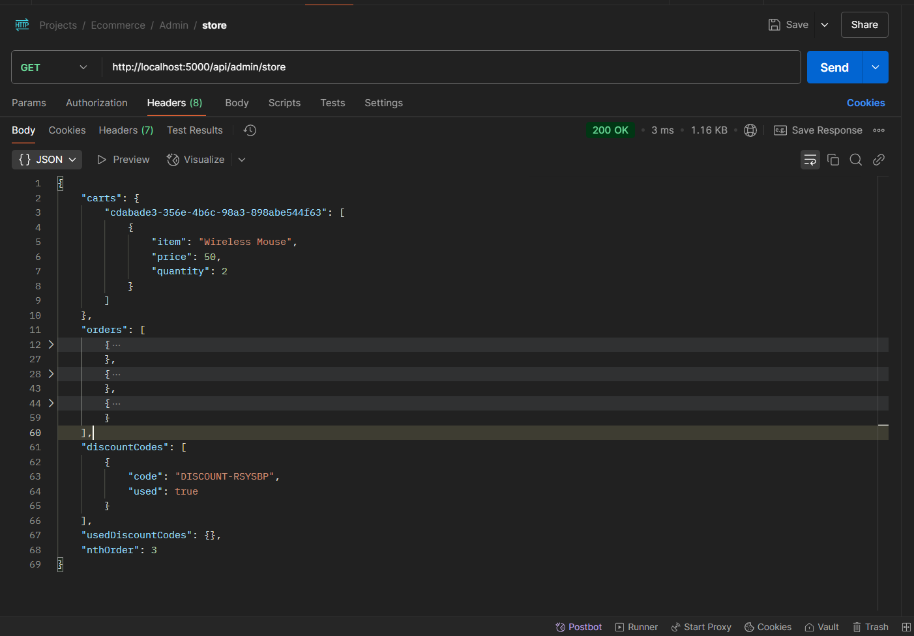
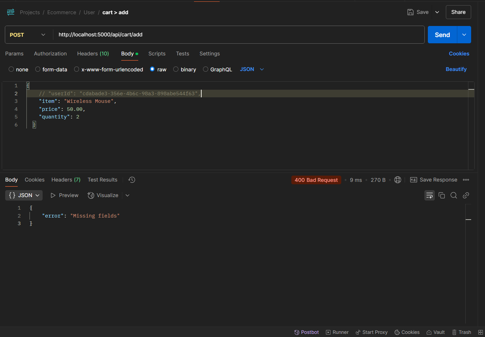
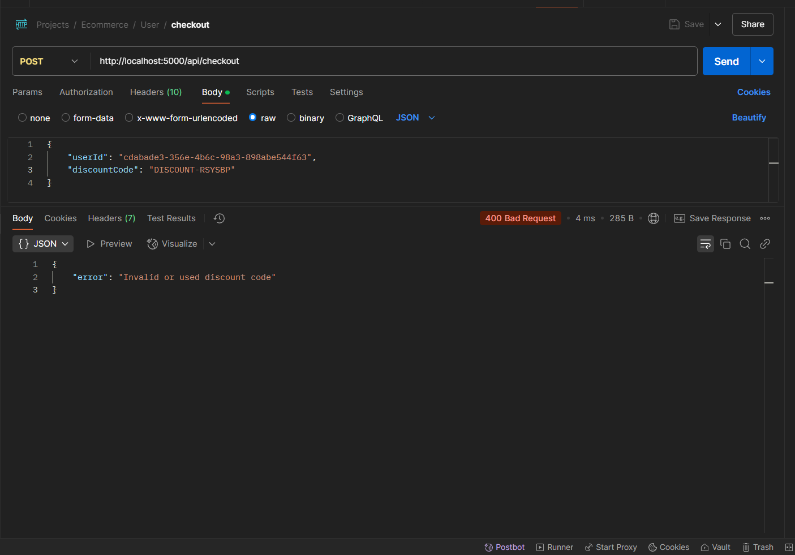
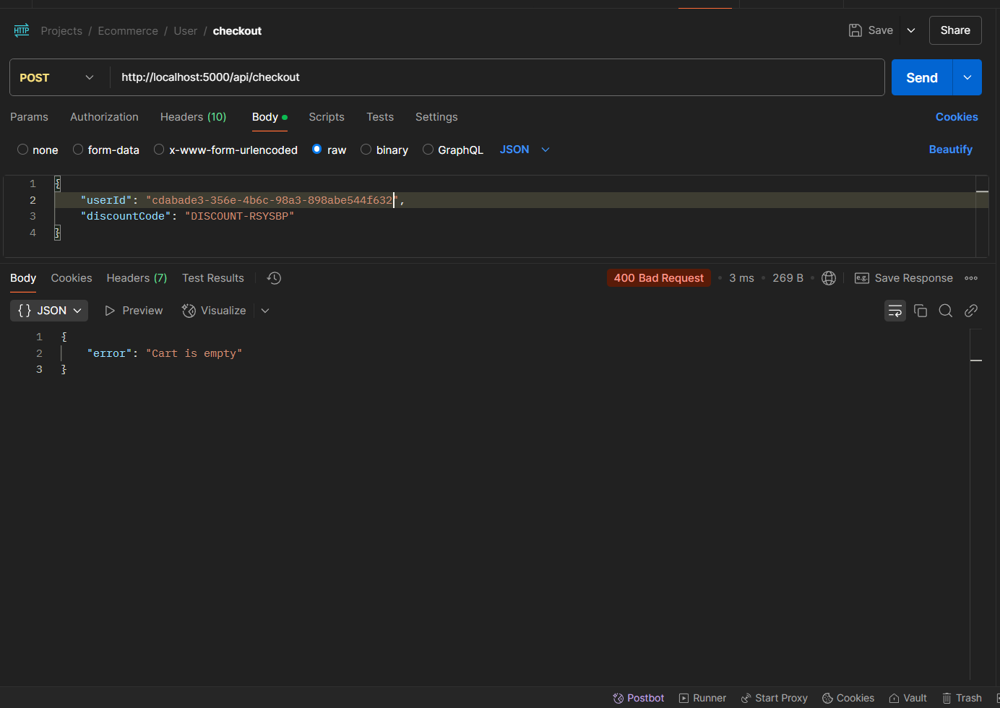
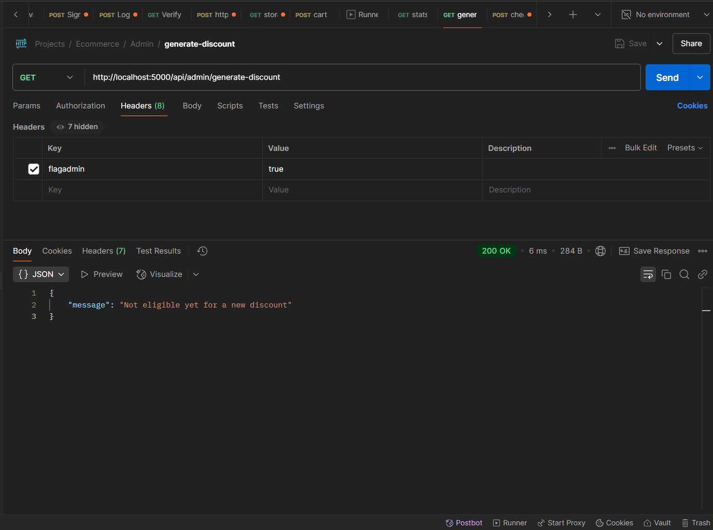

# 🛒 E-Commerce Backend API


## 📖 Project Overview

This is the backend API for an e-commerce platform built using the Nodejs. It provides endpoints for managing add to cart and place order feature.

## 🚀 Features

- Add to cart
- Place order
- Get all Statistics (only admin have access)
- Generate Coupon Code (only admin have access)

## 🛠️ Technologies Used

- **Node.js**: Runtime environment.
- **Express.js**: Backend framework.

## 📂 Folder Structure

```
/ecommerce-backend
├── controllers/
├── routes/
├── config/
├── service
├── storage
├── util
├── .env.{environments}
└── app.js
```

## 📌 API Endpoints

### User Endpoints

* **POST /api/cart/add** - Add an item to the user's cart.
* **POST /api/checkout** - Place an order with an optional discount code.

### Admin Endpoints

* **GET /api/admin/generate-discount** - Generate a discount code if the next order is eligible.
* **GET /api/admin/stats** - Returns item count, total purchases, discount codes, and total discounts applied.

### Note: Please find Ecommerce.postman_collection.json file for all endpoints (you can direcly import that in postman) and enjoy this project

## 📦 Installation

1. Clone the repository:
    ```bash
    git clone https://github.com/Dhaval1112/ecommerce-backend.git
    ```
2. Install dependencies:
    ```bash
    npm install
    ```
3. Set up environment variables in a `.env` file:
    ```
    PORT=5000
    DISCOUNT_EVERY_NTH_ORDER=3 # nth order
    DISCOUNT_PERCENT=0.1 # means 10%
    ```
4. Start the server:
    ```bash
    npm run {according-to-package-script} 
    OR
    npm start
    ```
---  

## 🖼️ Test cases with reference screenshots
Add to cart


Checkout without discount


Generate Coupon (by admin) before nth order 


Checkout with discount


Statistics (stats) API for the admins


Store API for getting all the store information (cart, orders, nth order value etc)



Validations
---  
When checkout code is invalid





